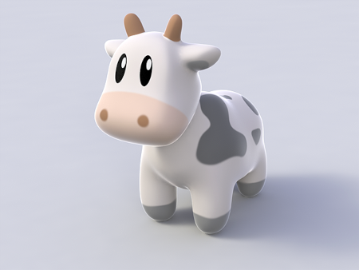
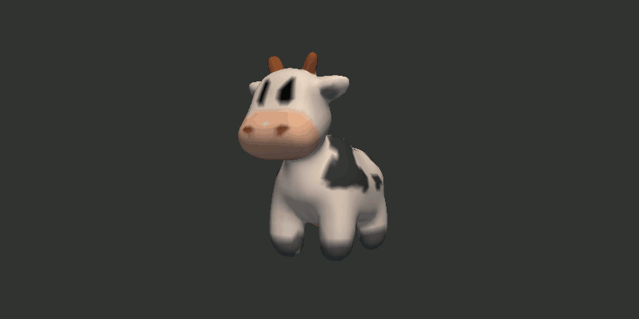
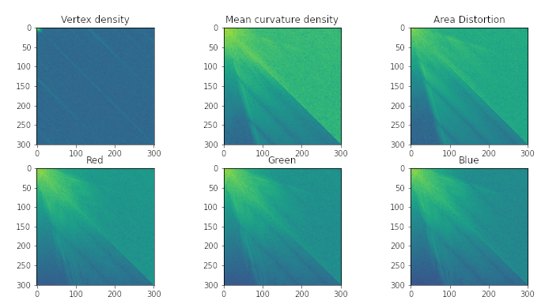
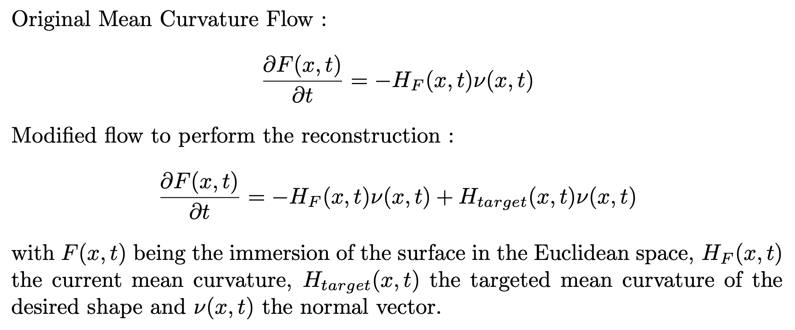
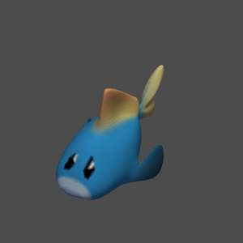
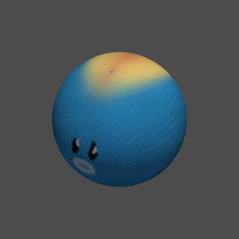
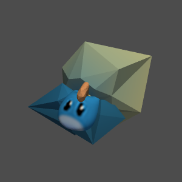

## How to transform a cow into spherical harmonics ?

*Spot the cow, from [Keenan Crane's blog](https://www.cs.cmu.edu/~kmcrane/Projects/ModelRepository/)*



### Context

In the field of Deep Learning, training on images or text has made enormous progress in recent years (with a lot of data available + CNN/Transformers). The results are not yet as good for other types of signals, such as videos or 3D models. For 3D models, some recent models use a graph-based approach to deal with 3D meshes, such as [Polygen](https://towardsdatascience.com/generating-3d-models-with-polygen-and-pytorch-4895f3f61a2e). However, these networks remain difficult to train. There are [plenty of alternative representations](https://towardsdatascience.com/how-to-represent-3d-data-66a0f6376afb) that have been used to train a Deep network on 3D models: voxels, multiview, point clouds, each having their advantages and disadvantages. In this project, I wanted to try a new one. In topology, a 3D model is nothing more than a 2D surface (possibly colored) embedded into a 3D space. If the surface is [closed](https://en.wikipedia.org/wiki/Surface_%28topology%29#Closed_surfaces), we can define an interior and an exterior, but that's it. It is not like a scalar field, which is defined throughout space. Since the data is 2D, it would be useful to be able to project this 3D representation in a 2D Euclidean space, on a uniform grid, like an image, to be able to use a 2D CNN to predict our 3D models.

Deep Learning models have proven effective in learning from [mel-spectrograms](https://towardsdatascience.com/audio-deep-learning-made-simple-part-2-why-mel-spectrograms-perform-better-aad889a93505) of audio signals, combined with convolutions. How to exploit this idea for 3D models? [All periodic signals can be approximated by Fourier series. We can therefore use a Fourier series to represent any periodic function in the complex plane. In geometry, the "drawing" of this function is a closed line, so it has the topology of a circle, in 2D space](https://olgaritme.com/posts/drawing-with-the-fourier-series/index.html). I tried to generalize this idea by using meshes with a spherical topology, which I reprojected on the sphere using a conformal (angle preserving) parametrization, then for which I calculated the harmonics thanks to a single base, that of [spherical harmonics](https://en.wikipedia.org/wiki/Spherical_harmonics).


The origin of this project is inspired by [this video](https://youtu.be/r6sGWTCMz2k) by 3blue1brown.


### Spherical harmonics of a 3D mesh

We only use meshes that have the topology of a sphere, i.e. they must be manifold and genus 0. The main idea is to get a spherical parametrization of the mesh, to define where are the attributes of the mesh on the sphere. Then, the spherical harmonic coefficients that best fit these attributes are calculated.

The attributes that interest us to describe the structure of the mesh are:
- Its geometric properties. We could directly give the XYZ coordinates, but thanks to the parametrization algorithm that is used, only the density of curvature is necessary. Consequently, we also need to know the area distortion, since our parametrization is not authalic (area preserving).
- Its colors, in RGB format. For simplicity, here I use colors by vertices, and not with a UV texture, so it loses detail.
- The vertex density of the mesh, which allows to put more vertices in areas that originally had a lot. This density is obtained using Von Mises-Fisher kernel density estimator.

*Calculates the spherical parametrization of the mesh, then displays its various attributes*



The spherical harmonic coefficients can be represented as images, with the coefficients corresponding to m=0 on the diagonal. The low frequencies are at the top left.

*Spherical harmonics coefficients amplitude as an image for each attribute*



### Reconstruction

We can reconstruct the model from the 6 sets of coefficients, which act as 6 functions on the sphere. We first make a spherical mesh inspired by what they made in ["A Curvature and Density based Generative Representation of Shapes"](https://arxiv.org/pdf/2009.02494.pdf). Some points are sampled according to the vertex density function. We then construct an isotropic mesh with respect to a given density, using Centroidal Voronoi Tesselation. The colors are interpolated at each vertex.

Then the shape is obtained by reversing our spherical parametrization. The spherical parametrization uses a mean curvature flow, which is a simple spherical parametrizations. We use the conformal variant from [Can Mean-Curvature Flow Be Made Non-Singular?](https://arxiv.org/pdf/1203.6819.pdf).

*Mean curvature flow equations. See [Roberta Alessandroni's
Introduction to mean curvature flow](https://tsg.centre-mersenne.org/item/10.5802/tsg.267.pdf) for more details on the notations*


*Reconstruction of the mesh using only spherical harmonics coefficients*


### Limitations

This algorithm needs meshes having the topology of a sphere and being manifold. In practice, there are also 2 main sources of error which prevent the algorithm from working on too complex meshes: the area distortion during the spherical parametrization which reduces the resolution at certain places, and the error of approximation of the spherical harmonics function. Here is an example where the algorithm fails to reconstruct the original mesh. [Blub the fish](https://www.cs.cmu.edu/~kmcrane/Projects/ModelRepository/) should fulfill the conditions for this to work, but because there is a high curvature on the fins and the tail, the reconstruction fails.

|      |  |  |
| ----------- | ----------- | ----------- |
| Initial mesh | Spherical parametrization | Failed reconstruction |

### Remarks

This project is a proof of concept. It allows to represent a model which has the topology of a sphere in spherical harmonics form. The results could be more precise, first with an authalic (area-preserving) parametrization rather than a conformal (angle-preserving) one. Also, I did not try to train a neural network using this representation, because that requires too much investment. It takes some pre-processing on [common 3D datasets](https://github.com/timzhang642/3D-Machine-Learning) to keep only the watertight genus-0 meshes, and then you have to do the training, which takes time. If anyone wants to try, I'd be happy to help.

I did it out of curiosity, and to gain experience, not to have an effective result. All algorithms used were coded in python/pytorch except for some solvers from [SciPy](https://scipy.org/) and spherical harmonics functions from [shtools](https://shtools.github.io/SHTOOLS/index.html). It makes it easier to read, but it could be faster using other libraries.

### Demo

Check the demo in Google Colab :
[](https://colab.research.google.com/github/le-Greg/mesh2sh/blob/master/main.ipynb)

To use the functions of this project you need the dependencies below. The versions indicated are those that I have used, and are only indicative.

- python (3.9.10)
- pytorch (1.9.1)
- scipy (1.7.3)
- scikit-sparse (0.4.6)
- pyshtools (4.9.1)

To run the demo *main.ipynb*, you also need :

- jupyterlab (3.2.9)
- trimesh (3.10.0)
- pyvista (0.33.2)
- pythreejs (optional, 2.3.0)

You can run these lines to install everything on Linux using conda :
```
conda create --name mesh2sh
conda activate mesh2sh
conda install python=3.9
conda install scipy=1.7 -c anaconda
conda install pytorch=1.9 cudatoolkit=11 -c pytorch -c conda-forge
conda install gmt intel-openmp -c conda-forge
conda install pyshtools pyvista jupyterlab -c conda-forge
conda update pyshtools -c conda-forge
pip install scikit-sparse
pip install pythreejs
pip install trimesh
```

Then just run the demo :
```
jupyter notebook main.ipynb
```

### Contribution

To run tests, you need pytest and flake8 :
```
pip install pytest
pip install flake8
```
You can check coding style using `flake8 --max-line-length=120`, and run tests using `python -m pytest tests/` from the root folder. Also, run the demo again to check that the results are consistent

### References

- Kazhdan, Michael & Solomon, Jake & Ben-Chen, Mirela. (2012). [Can Mean-Curvature Flow be Modified to be Non-singular?.](https://www.cs.jhu.edu/~misha/MyPapers/SGP12.pdf) Computer Graphics Forum. 31. 1745-1754. 10.1111/j.1467-8659.2012.03179.x.
- Ye, Zi & Umetani, Nobuyuki & Igarashi, Takeo & Hoffmann, Tim. (2020). [A curvature and density-based generative representation of shapes.](https://arxiv.org/pdf/2009.02494.pdf)
- Sinha, Ayan & Bai, Jing & Ramani, Karthik. (2016). [Deep Learning 3D Shape Surfaces Using Geometry Images.](https://link.springer.com/chapter/10.1007/978-3-319-46466-4_14) 9910. 223-240. 10.1007/978-3-319-46466-4_14.
- Deckelnick, K., Dziuk, G., & Elliott, C. (2005). [Computation of geometric partial differential equations and mean curvature flow.](https://www.maths.warwick.ac.uk/multiscale/MSPreprints/KD-GD-CME_GeoPdeFlow.pdf) Acta Numerica, 14, 139-232. doi:10.1017/S0962492904000224
- [Möbius Registration](https://github.com/mkazhdan/MoebiusRegistration) for a cMCF implementation in C++
- [Spherical Kernel Density Estimation](https://github.com/williamjameshandley/spherical_kde) for a Von Mises-Fisher KDE numpy implementation
